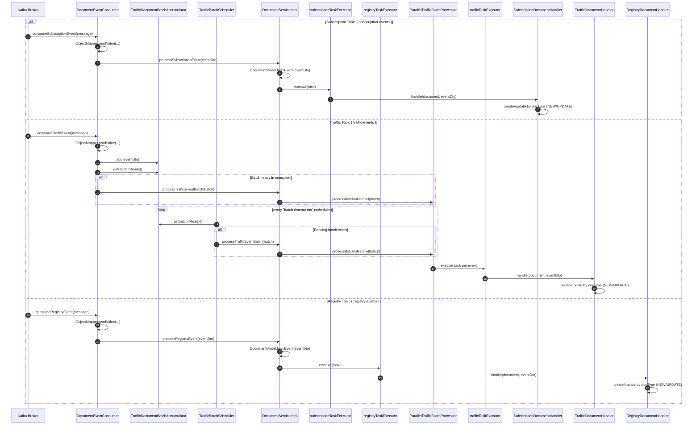

# Document Service

`document-service` consumes document events from Kafka and processes them by topic-specific flow:
- `subscription-events` -> async handler execution
- `traffic-events` -> batch accumulation + parallel processing
- `registry-events` -> async handler execution

## Code Flow Sequence Diagram

