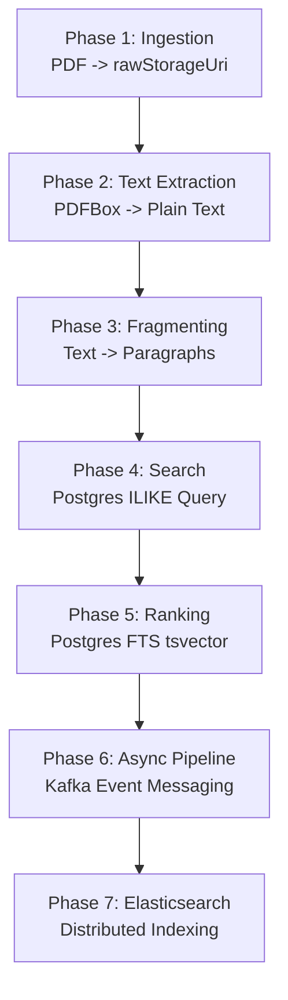

# Shared Domain Models Documentation

This document describes the role, fields, and use cases of each model in the `com.searchengine.shared.models` package. It details how they map to the project's step-by-step implementation phases (Phases 0 through 7).

---

## 🗺️ Project Implementation Roadmap

The Search Engine is developed in incremental phases, starting from database structures and moving through synchronous ingestion, text extraction, fragmenting, search, and finally asynchronous Kafka pipelines and Elasticsearch.

---

## 🗄️ Domain Model Details

### 1. `CrawlStatus` (Enum)
Defines the state of a document in the crawling and processing lifecycle.
* **Fields / Constants**:
  * `DISCOVERED`: Document has been uploaded or found, but content is not fetched/extracted yet.
  * `CRAWLING`: Active extraction/crawling is underway.
  * `CRAWLED`: Processing completed successfully; content is extracted and split.
  * `FAILED`: Processing failed (e.g. bad file formatting, network error).
  * `SKIPPED`: Document ignored (e.g. disallowed by robots.txt or content-type mismatch).
* **Role**: Drives the state transition logic in the ingestion and extraction services. Introduced in **Phase 0/1** and updated in **Phase 2**.

---

### 2. `CrawledDocument`
The metadata registry representing any document discovered by the system or uploaded by a user.
* **Key Fields**:
  * `documentId`: Unique system identifier.
  * `version`: Optimistic locking version for event ordering (critical when introduced to Kafka in **Phase 6**).
  * `url` / `canonicalUrl`: Standardized URLs to prevent duplicate indexing.
  * `contentType`: MIME type (e.g. `application/pdf`, `text/html`) used to route the document to the appropriate parser.
  * `status`: Current `CrawlStatus`.
  * `contentHash` / `simhash`: SHA-256 and near-duplicate SimHash fingerprint values to identify duplicate documents.
* **Role**: Serves as the central metadata registry. Created during **Phase 1 (Document Ingestion)** with a status of `DISCOVERED`.

---

### 3. `CrawledDocumentContent`
Stores the raw extracted text of the document before it gets split into fragments.
* **Key Fields**:
  * `documentId`: Foreign key linking to the `CrawledDocument`.
  * `extractedText`: The actual plain text extracted from the document.
  * `textLength`: Document length metadata.
* **Role**: Holds the source-of-truth text. Created during **Phase 2 (Text Extraction)** via parser libraries (e.g. PDFBox).

---

### 4. `Document`
A high-level record tracking file storage locations (URIs) across local and cloud environments.
* **Key Fields**:
  * `documentId`: System-wide identifier.
  * `rawStorageUri`: Location of the raw file (e.g. `storage/raw/document-123.pdf`).
  * `textStorageUri`: Location of the extracted text file (used if the text is stored outside the DB).
* **Role**: Connects database metadata to physical storage paths. Populated during **Phase 1** (raw) and updated in **Phase 2** (text).

---

### 5. `DocumentFragment`
The atomic unit of search. Documents are too large to index or return as search hits, so they are broken down into searchable fragments.
* **Key Fields**:
  * `fragmentId`: Primary Key.
  * `documentId`: Foreign key linking back to `Document`.
  * `fragmentOrder`: Integer sequence order representing the fragment's position in the original document.
  * `content`: The text content of the fragment (e.g. a paragraph).
  * `startOffset` / `endOffset`: Character index boundaries in the source text, used for search term highlighting.
* **Role**: Search queries match against fragments. Created in **Phase 3 (Fragment Generation)** and queried in **Phase 4** (Postgres `ILIKE`), **Phase 5** (Postgres FTS), and **Phase 7** (Elasticsearch).

---

### 6. `DocumentLink`
Tracks hyperlinks discovered inside processed documents to expand crawling.
* **Key Fields**:
  * `id`: Primary key.
  * `sourceDocumentId`: The document containing the link.
  * `targetUrl`: The URL pointing to the referenced resource.
  * `anchorText`: Clickable text associated with the hyperlink.
* **Role**: Feeds the discovery engine to discover new pages to crawl. Created dynamically during **Phase 2** when links are parsed from HTML or PDF docs.

---

## 📊 Summary of Model Relations

| Model Name | Primary Key | Foreign Key References | Introduced in |
|---|---|---|---|
| **`CrawlStatus`** | N/A (Enum) | N/A | Phase 1 |
| **`CrawledDocument`** | `documentId` | N/A | Phase 1 |
| **`CrawledDocumentContent`** | N/A | `documentId` -> `CrawledDocument` | Phase 2 |
| **`Document`** | `documentId` | N/A | Phase 1 |
| **`DocumentFragment`** | `fragmentId` | `documentId` -> `Document` | Phase 3 |
| **`DocumentLink`** | `id` | `sourceDocumentId` -> `CrawledDocument` | Phase 2 |
